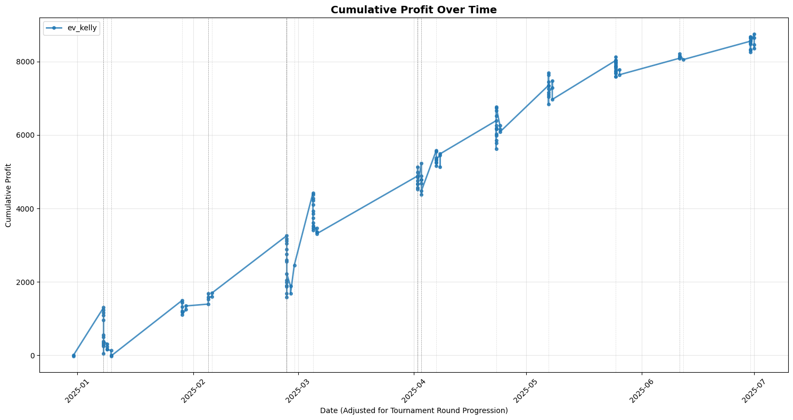

# Tennis Match Prediction & Betting Strategy Model

A production-grade machine learning system that predicts tennis match outcomes and implements profitable betting strategies through a sophisticated multi-stage data pipeline, chronological statistics engine, and ensemble modeling.

## 🎯 Project Overview

This project demonstrates end-to-end data engineering and machine learning capabilities by building a predictive model for ATP tennis matches. The system processes 80,000+ historical matches through a 4-stage pipeline that utilises REST APIs, Historical Data, SQL Databases, and maintains chronologically-ordered statistics with strict temporal boundaries to prevent data leakage, and achieves **73.2% accuracy** and **81.1% AUC** on test data. Betting strategies show **54.7% ROI** on 2025 matches backtested on real historical odds data.

### Betting Strategy Performance (2025 Backtested Data)

## 🔑 Key Technical Features

### 🏗️ Production Data Pipeline Architecture
Built a robust 4-stage ETL pipeline with automated data quality checks and duplicate prevention:

**Stage 1: Data Cleaning & Integration**
- Custom web scrapers for InfoSys/ATP API fetching real-time tournament data [InfoSys Processing](InfoSys_API_PreClean.ipynb)
- Multi-source data fusion: Jeff Sackmann historical dataset (1991-2024) + InfoSys API (2025+) + tennis-odds datasets [Historical Data Processing](JeffSackmannPreClean.ipynb)
- Automated tournament calendar scraping with JSON parsing and retry logic
- Set-by-set score parsing and advanced match statistics extraction

**Stage 2: Entity Resolution & Unification**
- Built fuzzy matching systems for tournament and player ID unification across data sources [Tournament Matching](tennis_matching/), [Player Matching](player_matching/)
- Implemented metadata validation (nationality, handedness, height) for player disambiguation
- SQLite-backed entity databases with interactive GUI confirmation workflows [Databases](databases/)
- Idempotent duplicate detection prevents reprocessing across 80K+ matches

**Stage 3: Statistics Generation Engine**
- Chronologically-ordered statistics calculation with strict temporal boundary enforcement[Custom Stats API](StatsProcessing/updateStats.py)
- ChronologicalDeque data structures enable O(1) append and efficient time-windowed queries[Chronological Storage](Utilities/chronological_storage.py)
- Sequential processing maintains data integrity and prevents look-ahead bias
- Comprehensive metrics: rolling win rates, H2H records, form indicators, tournament performance

**Stage 4: Elo Rating System**
- Surface-specific Elo ratings (Hard/Clay/Grass/Carpet) with general rating[Elo Manager](EloProcessing/elo_manager.py)
- Dynamic K-factor adjustments based on tournament level, round importance, and best-of format
- Batch processing with checkpointing for 80K+ match datasets
- Automatic recalculation detection for out-of-order match insertion

### 🧠 Advanced Feature Engineering
- **153 engineered features** from 43,000+ chronologically-processed matches
- **Dynamic Elo ratings**: Surface-specific ratings with tournament-weighted K-factor adjustments
- **Multi-window rolling statistics**: Performance metrics across 5/10/25/50/100/200 match windows
- **Head-to-head metrics**: Historical matchup statistics with surface and tournament-specific adjustments
- **Form indicators**: Recent performance tracking (1-month, 3-month windows)
- **Temporal feature engineering**: Elo gradients (momentum indicators), player activity tracking
- **Data leakage prevention**: Strict before_time filtering ensures only historical data used for predictions

### 🤖 Machine Learning Pipeline
- **Feature selection**: Reduced dimensionality from 153 to 31 features using importance-based selection (top 20%)
- **Hyperparameter optimization**: Bayesian optimization (Optuna) with 5-fold stratified cross-validation over 200 trials
- **Temporal validation**: Train/test splits respect chronological ordering to simulate real-world deployment
- **Model persistence**: Serialized XGBoost models with feature metadata for production inference

### 📈 Quantitative Strategy Implementation
- **Kelly Criterion betting**: Fractional Kelly (25%) for optimal stake sizing with variance reduction
- **Edge detection**: Expected value calculations comparing model probabilities vs. market odds
- **Risk management**: Monte Carlo simulations (1000 runs) to estimate drawdown and bankruptcy probabilities
- **Backtesting framework**: Sequential simulation with dynamic bankroll tracking and compounding effects

## 🏆 Results & Performance

### Model Metrics
- **Training Accuracy**: 99.99%
- **Test Accuracy**: 73.2%
- **AUC Score**: 81.1%
- **Cross-validation AUC**: 80.7% ± 0.26%

### Key Strategy Metrics
- **Total Bets Placed**: 162
- **Win Rate**: 74% 
- **ROI**: 54.7%

## 🛠 Technical Stack

### Core Technologies
- **Data Processing**: Pandas, NumPy, SQLite
- **Machine Learning**: XGBoost, Scikit-learn
- **Optimization**: Optuna (Bayesian hyperparameter tuning with Tree-structured Parzen Estimator)
- **Web Scraping**: Custom InfoSys/ATP API client, Requests, JSON parsing
- **Visualization**: Matplotlib, Plotly
- **Statistical Analysis**: Custom Elo rating system, Kelly Criterion implementation

### Software Engineering
- **Data Structures**: Custom ChronologicalDeque for temporal ordering and efficient time-windowed queries
- **Entity Resolution**: RapidFuzz for fuzzy matching, Tkinter GUI for interactive confirmation
- **Persistence**: JSON serialization with gzip compression, Pickle for model storage
- **Testing**: Unit tests for batch processing and statistics validation
- **Pipeline Orchestration**: Modular 4-stage ETL with automatic backup and rollback

## 🏗️ Architecture Highlights

### 1. Data Pipeline Engineering
- **Multi-stage ETL pipeline** processing 80K+ matches with automated duplicate detection
- **Entity resolution systems** unifying tournaments and players across heterogeneous data sources
- **Idempotent processing** with match ID tracking prevents duplicate statistics calculation
- **Chronological storage** with lazy sorting balances insertion performance and query efficiency
- **Automated backup protocol** with timestamped recovery points and compression

### 2. Statistical Rigor
- **Temporal boundary enforcement** prevents data leakage through strict before_time filtering
- **Sequential processing** maintains data integrity for statistics calculation
- **Multi-window rolling statistics** provide robustness across different sample sizes
- **Surface-specific Elo ratings** capture playing style and court type interactions
- **Dynamic K-factor adjustments** weight matches by importance (Grand Slams > Masters > ATP 250)

### 3. Machine Learning Excellence
- **Feature engineering**: Domain-driven features (Elo gradients, form indicators, H2H records)
- **Dimensionality reduction**: Importance-based feature selection reduces overfitting
- **Hyperparameter optimization**: 200-trial Bayesian search with 5-fold CV (1000+ model evaluations)
- **Model interpretability**: Feature importance analysis reveals key predictors (Elo, rankings, form)

### 4. Quantitative Finance Application
- **Kelly Criterion implementation**: Fractional Kelly (25%) balances growth and risk
- **Expected Value filtering**: Only bet when model edge exceeds threshold (EV ≥ 0.2)
- **Monte Carlo risk analysis**: 1000-run simulations estimate bankruptcy probability
- **Sequential backtesting**: Realistic simulation with dynamic bankroll and compounding

## 💡 Business Impact

This project demonstrates capabilities highly relevant to data science and quantitative roles:

### Data Engineering
- Building production ETL pipelines with data quality checks and error handling
- Integrating heterogeneous data sources with entity resolution and fuzzy matching
- Designing efficient data structures for temporal queries and large-scale processing
- Implementing persistent storage with backup/recovery and compression

### Machine Learning
- End-to-end model development from feature engineering to deployment
- Preventing data leakage through temporal validation and strict time boundaries
- Hyperparameter optimization with Bayesian methods for efficient search
- Model evaluation with cross-validation and domain-appropriate metrics

### Quantitative Analysis
- Applying quantitative finance principles (Kelly Criterion) to real-world problems
- Risk management through Monte Carlo simulation and drawdown analysis
- Developing profitable strategies with realistic constraints and transaction costs
- Backtesting frameworks that simulate production deployment scenarios

### Software Engineering
- Writing modular, maintainable code with clear separation of concerns
- Implementing custom data structures optimized for specific use cases
- Building interactive tools (GUI workflows) for human-in-the-loop processing
- Comprehensive testing and validation of complex data pipelines
